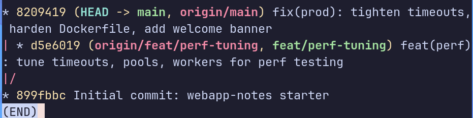
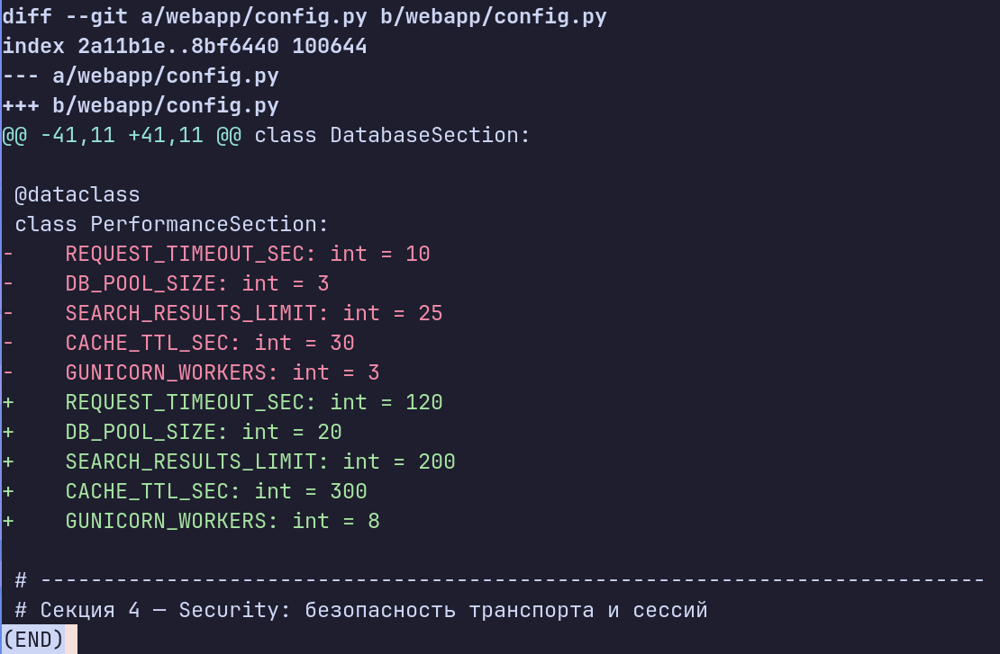
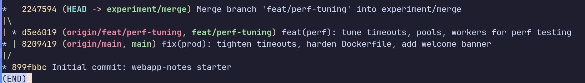
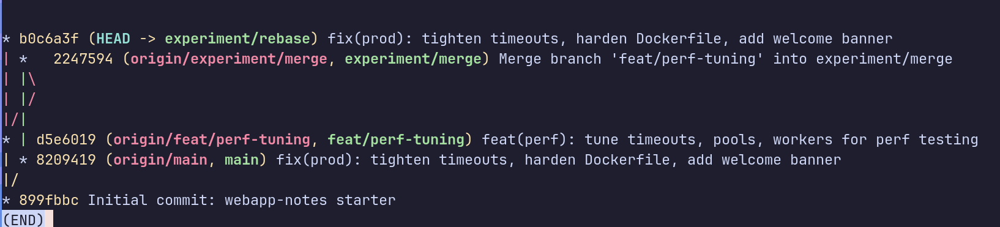
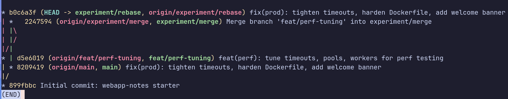

# LAB — день 4

Курс: [«Интенсив по погружению в GIT»](https://slurm.io/git-intensive)

## Базовая задача — `01-merge-vs-rebase`

### Стартовое состояние

Создана ветка `feat/perf-tuning` с изменениями в 4 файлах под нагрузочное
тестирование: подняты таймауты, пул соединений, воркеры gunicorn, лимит
поиска. Параллельно на `main` сделан встречный коммит с продакшен-настройками:
консервативные таймауты, hardening Dockerfile, welcome-баннер.

```bash
git log --oneline --graph --all
# * 8209419 (main) fix(prod): tighten timeouts, harden Dockerfile, add welcome banner
# | * d5e6019 (feat/perf-tuning) feat(perf): tune timeouts, pools, workers for perf testing
# |/
# * 899fbbc Initial commit: webapp-notes starter
```



### Путь A — через `merge`

Создана ветка `experiment/merge` от `main`, влита `feat/perf-tuning` через
`git merge`. Конфликты возникли в 4 файлах одновременно. Все файлы разрешены
через CLI (vim) — оставлена perf-версия как результат слияния. После
разрешения всех конфликтов создан merge-коммит с двумя родителями.

```bash
git switch -c experiment/merge
git merge feat/perf-tuning
# разрешаем конфликты в 4 файлах
git add webapp/config.py webapp/services.py webapp/templates/index.html Dockerfile
git commit
```





### Путь B — через `rebase`

Создана ветка `experiment/rebase` от `main`, сделан rebase поверх
`feat/perf-tuning`. Конфликты возникли на единственном переносимом коммите
в тех же 4 файлах — оставлена prod-версия. После разрешения запущен
`git rebase --continue`. История получилась линейной — без merge-коммита.

```bash
git switch -c experiment/rebase
git rebase feat/perf-tuning
# разрешаем конфликты в 4 файлах
git add webapp/config.py webapp/services.py webapp/templates/index.html Dockerfile
git rebase --continue
```



### Сравнение

Финальная история всех веток рядом:



- **merge**: история нелинейная, виден merge-коммит с двумя родителями,
  хеши исходных коммитов не изменились, ветка видна как отдельная линия
- **rebase**: история линейная, merge-коммита нет, хеши коммитов изменились
  (Git создал новые объекты), ветвление в истории не видно

### Какой подход я бы выбрал в команде и почему

Для слияния готовой фичи в `main` через PR — **merge**: история честная,
видно что и когда сливалось, хеши не меняются и коллеги не пострадают.

Для обновления своей приватной ветки от свежего `main` перед созданием PR —
**rebase**: история становится линейной, коллегам проще делать ревью, и
золотое правило не нарушается (ветка ещё приватная).
